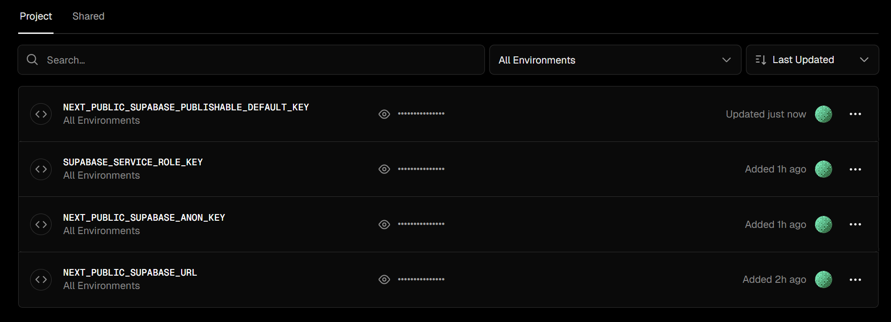
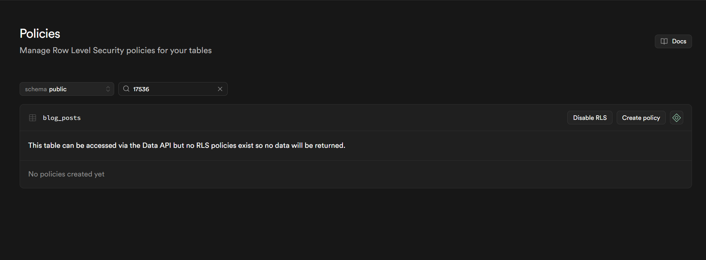

# Landing Page - Beatriz Favinchi Rossi

Landing Page moderna e responsiva para Beatriz Favinchi Rossi, psicóloga com atuação em psicanálise e recursos lúdicos com jogos de tabuleiro.

## 🎯 Objetivo

Desenvolver uma Landing Page focada em:
- Apresentar a profissional Beatriz Favinchi Rossi e suas competências em Psicanálise
- Aumentar o número de pacientes particulares
- Envolver usuários com a dinâmica da profissional que utiliza jogos de tabuleiro para auxiliar na melhora de saúde mental

## 🎨 Paleta de Cores

- **#805D93** (Roxo principal) - Headers, CTAs, destaques
- **#F49FBC** (Rosa suave) - Acentos, hover states
- **#FFD3BA** (Pêssego claro) - Backgrounds suaves, cards
- **#9EBD6E** (Verde claro) - Sucesso, confirmações
- **#169873** (Verde escuro) - Textos secundários, elementos de apoio

## 🛠️ Stack Tecnológica

- **Framework**: Next.js 14+ (App Router)
- **Linguagem**: TypeScript
- **Estilização**: Tailwind CSS
- **Deploy**: Vercel

## 📁 Estrutura do Projeto

```
Psi_BiaRossi/
├── src/
│   ├── app/                    # Next.js App Router
│   │   ├── layout.tsx           # Layout principal
│   │   ├── page.tsx            # Página inicial
│   │   └── globals.css        # Estilos globais
│   ├── components/              # Componentes React
│   │   ├── sections/            # Seções da landing page
│   │   │   ├── Hero.tsx
│   │   │   ├── About.tsx
│   │   │   ├── Services.tsx
│   │   │   ├── Gamification.tsx
│   │   │   ├── Contact.tsx
│   │   │   └── Testimonials.tsx
│   │   ├── ui/                  # Componentes UI reutilizáveis
│   │   │   ├── Button.tsx
│   │   │   ├── ContactForm.tsx
│   │   │   └── Card.tsx
│   │   └── layout/              # Componentes de layout
│   │       ├── Header.tsx
│   │       └── Footer.tsx
│   ├── lib/                     # Utilitários
│   │   └── utils.ts
│   └── types/                   # TypeScript types
│       └── index.ts
├── public/                      # Assets estáticos
│   ├── images/
│   └── icons/
├── package.json
├── tsconfig.json
├── tailwind.config.ts
├── next.config.js
└── README.md
```

## 🚀 Como Executar

### Instalação

```bash
npm install
```

### Desenvolvimento

```bash
npm run dev
```

Acesse [http://localhost:3000](http://localhost:3000) no navegador.

### Build para Produção

```bash
npm run build
npm start
```

### Lint

```bash
npm run lint
```

## 📋 Seções da Landing Page

1. **Hero** - Banner principal com CTA
2. **Sobre** - Biografia e formação da profissional
3. **Serviços** - Listagem de serviços oferecidos
4. **Gamificação** - Explicação da metodologia com jogos de tabuleiro
5. **Depoimentos** - Carrossel com depoimentos de pacientes
6. **Contato** - Formulário de contato e informações

## ✨ Funcionalidades

- ✅ Design responsivo (mobile-first)
- ✅ Navegação suave entre seções
- ✅ Menu hambúrguer para mobile
- ✅ Formulário de contato com validação
- ✅ Carrossel de depoimentos
- ✅ Acessibilidade (ARIA labels, navegação por teclado)
- ✅ Otimização de performance

## 📝 Pontos de Atenção

1. **Conteúdo**: Textos são placeholders - substituir com conteúdo real da profissional
2. **Imagens**: Usar placeholders - substituir com fotos reais quando disponíveis
3. **Formulário**: Estrutura pronta, mas requer backend/API para funcionamento completo
4. **Depoimentos**: Estrutura pronta para receber depoimentos reais
5. **SEO**: Adicionar meta tags e Open Graph quando conteúdo real estiver disponível

## 🔮 Melhorias Futuras

- Integração com calendário para agendamento online
- Blog/artigos sobre psicanálise
- Área de login para pacientes
- Chat online
- Integração com redes sociais
- Analytics e tracking

## 📄 Licença

Este projeto é privado e destinado ao uso da profissional Beatriz Favinchi Rossi.

## 🔧 Configuração do Blog (Supabase)

A seção de Blog está preparada para ler posts publicados da tabela `blog_posts` no Supabase.
Se as variáveis não estiverem configuradas, a página usa fallback local automaticamente.

### 1) Variáveis de ambiente (Vercel e local)

```bash
NEXT_PUBLIC_SUPABASE_URL=https://SEU-PROJETO.supabase.co
NEXT_PUBLIC_SUPABASE_ANON_KEY=SUA_ANON_KEY
```

### 2) SQL da tabela

Execute no SQL Editor do Supabase:

```sql
create table if not exists public.blog_posts (
  id uuid primary key default gen_random_uuid(),
  title text not null,
  slug text not null unique,
  excerpt text not null,
  content text not null,
  published_at timestamptz not null default now(),
  status text not null check (status in ('draft', 'published')) default 'draft'
);

create index if not exists blog_posts_status_published_at_idx
  on public.blog_posts (status, published_at desc);
```

Se você já criou a tabela antes (sem a coluna `content`), rode:

```sql

```

### 3) Publicação de conteúdo

- `status = 'draft'`: não aparece no site
- `status = 'published'`: aparece na seção Blog

### 4) Checklist de deploy Vercel

- Configurar variáveis `NEXT_PUBLIC_SUPABASE_URL` e `NEXT_PUBLIC_SUPABASE_ANON_KEY`
- Configurar `SUPABASE_SERVICE_ROLE_KEY` (necessário para publicar posts via rota `/post`)
- Confirmar build: `npm run build`
- Publicar branch atual

## 🕵️ Área Profissional para Blog (rota oculta `/post`)

Para que a profissional crie posts sem acessar o Supabase Dashboard:

1. Abra a rota `/post` no site.
2. Faça login (ou crie a conta) usando e-mail e senha do Supabase.
3. No formulário, preencha `título`, `slug`, `resumo` e selecione o `status` (Draft ou Publicado).
   - O campo `conteúdo completo (Markdown)` é obrigatório para a página `/blog/[slug]`.
4. Ao publicar, a seção `/Blog` já exibirá os cards dos posts com `status = published`.

### Variáveis adicionais (no Vercel/local)

- `SUPABASE_SERVICE_ROLE_KEY`: chave de Service Role para permitir inserção server-side.
- `BLOG_ADMIN_EMAIL` (recomendado): se definido, somente este e-mail poderá publicar. Se não estiver definido, qualquer usuário autenticado poderá publicar.

### Observação

- Se no Supabase estiver ativa confirmação de e-mail para sign-up, pode ser necessário confirmar antes de conseguir fazer login.

